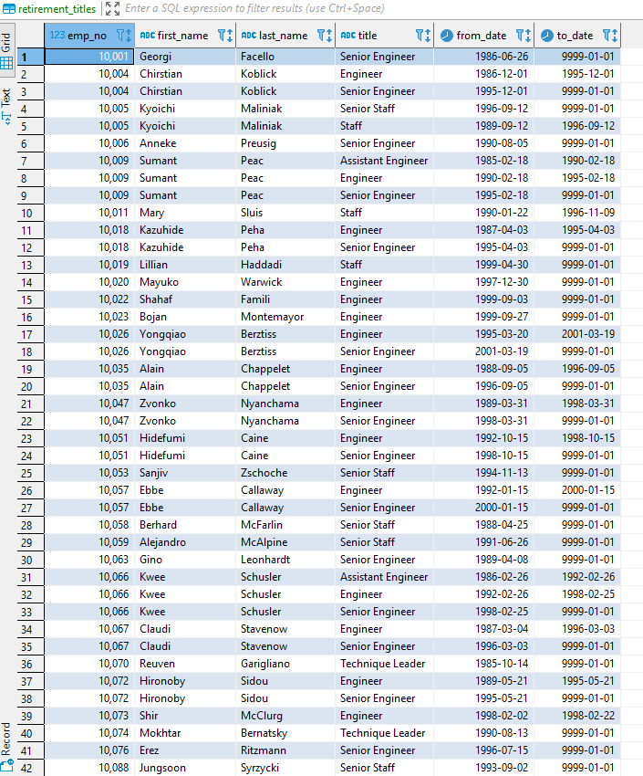
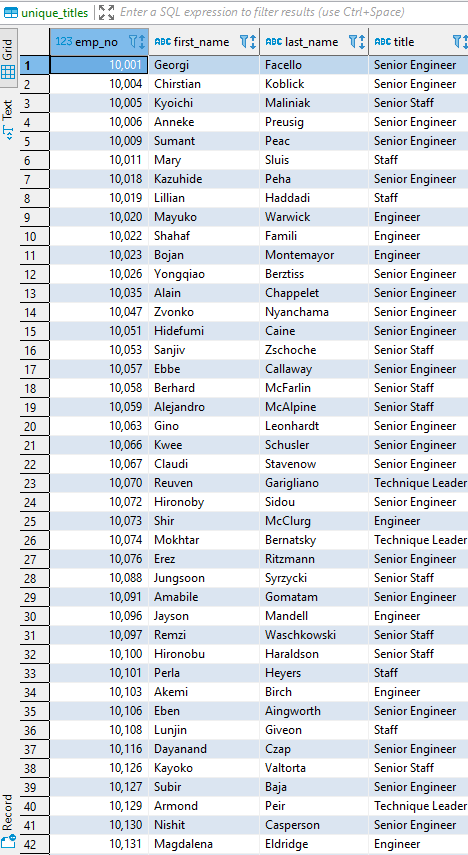
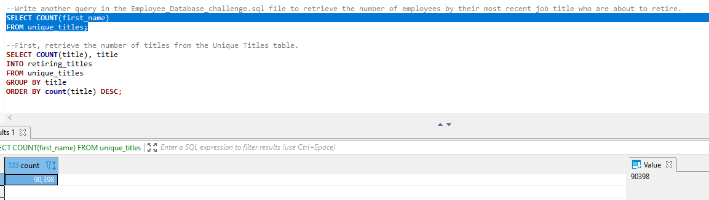
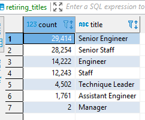
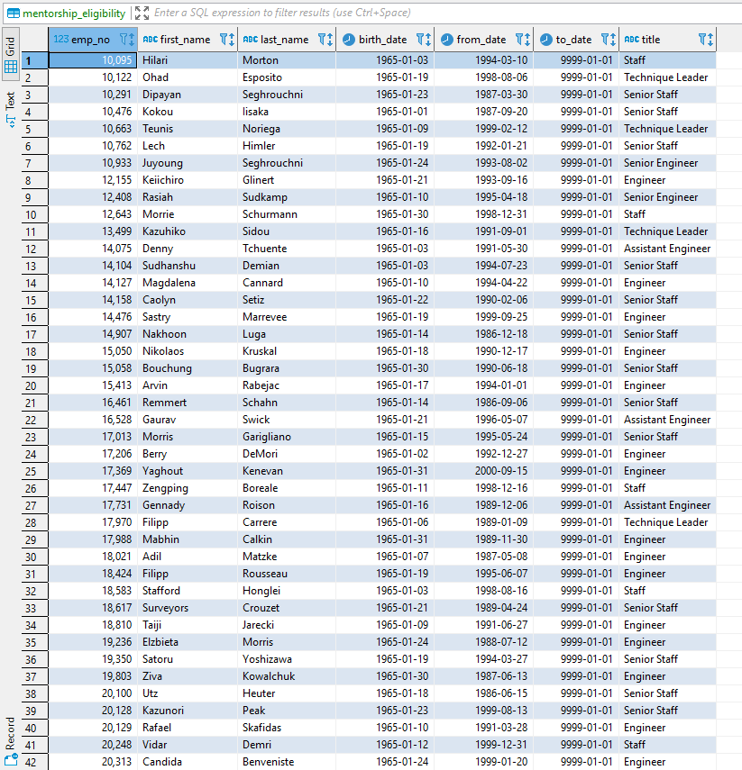
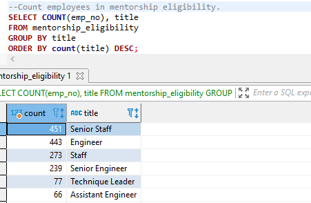

# Pewlett-Hackard-Analysis

## Overview of Analysis
I used PostgreSQL through DBeaver instead of pgAdmin to use data from 6 excels to create a database off module work of for employees with their relevant information, and creating tables, joining tables, and finding out retirement information for employees.
The challenge took over at the point where a specific manager, Bobby, requested the employee information such as number, name, as well as their most recent title and date where transition occurred.
Several employees have had multiple titles over the years so the distinct coding needed to be used to only use the latest title.

The second ask focused on  the same information except it focused on a different timeline - those born in the year 1965 to start a mentorship program with those retiring who will be retiring in the coming years.

## Results

 *TABLE 1 Retiring Titles List with duplicate employee names due to title changes*

 *TABLE 2 Retiring Titles List with unique values so employees only listed once*

- Before using "distinct", duplicate values were showing, such as Christian Koblick who held the title of engineer prior to being a senior engineer as seen on TABLE 1. After using "distinct," employees with title changes like Christian Koblick only show up once as seen on TABLE 2. This table is what was used or the next analysis. 

 *TABLE 3 Unique Titles Count*
- 90,398 employees are retiring from their current positions.

 *TABLE 4 Retiring Titles Total Count per Title*
- Of the 90,398 employees retiring, these are the following amounts for each title. 
    - 29,414 are senior engineers
    - 28,254 are senior staff
    - 14,222 are engineers
    - 12,243 are staff
    - 4,502 are technique leaders
    - 1,761 are assistant engineers
    - 2 are managers
- This means the majority of employees retiring are considered senior with senior engineers and staff. 

 *TABLE 5 Mentorship List*
- The final piece was creating a list of employees born in 1965 to help begin a mentorship program for new employees. Previously we had looked at those born from 1952 to 1955 but those are soon to retire but by using 1965 we allow a time for a program to be developed, but also enough time for the future retiring employee to mentor a newer employee.

## Summary
- **How many roles will need to be filled as the "silver tsunami" begins to make an impact?**
    - 90,398 employees are set to retire in the coming years.
- **Are there enough qualified, retirement-ready employees in the departments to mentor the next generation of Pewlett Hackard employees?**
 *TABLE 5 Mentorship List*
    - Adding to my existing code, I added count for total employee numbers eligible for the mentorship program that were born in 1965. Compared to the retiring list wth unique titles as seen in TABLE 4, there are the following available mentors for soon to be open roles with employees soon set to retire.
        - 239 for the 29,414 senior engineers
        - 451 for the 28,254 senior staff (which is more than senior engineers which was the highest of retirees)
        - 443 for the 14,222 engineers
        - 273 for the 12,243 staff
        - 77 for the 4,502 technique leaders
        - 66 for the 1,761 assistant engineers
        - 0 for the 2 managers retiring
    -With this being said, there are not enough eligible mentors for each of the categories. Senior Engineers should have the most mentors, but is one of the lowest and there are not mentors for managers. The company will likely need to expand the birth_date criteria to capture those who could mentor employees given 90,398 are set to retire soon.

